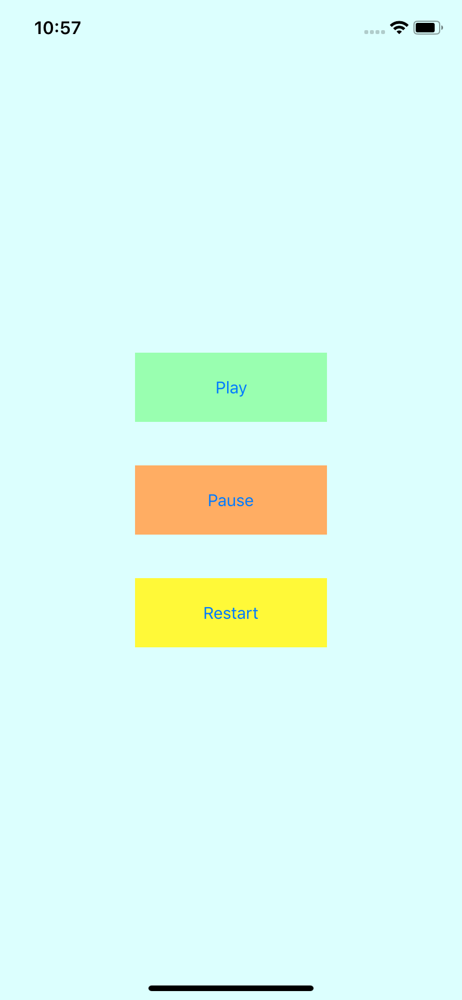

# Play Audio Snippet

How to play audio in Swift 5. <br>

In this snippet, the ```AVFoundation``` library is imported and an instance of ```AVAudioPlayer``` is created to handle the play, pause and restart functions of the audio.

## Tech Specs

- Supports iOS 12 and iOS 13
- Swift 5

<p align="center">
  
</p>

